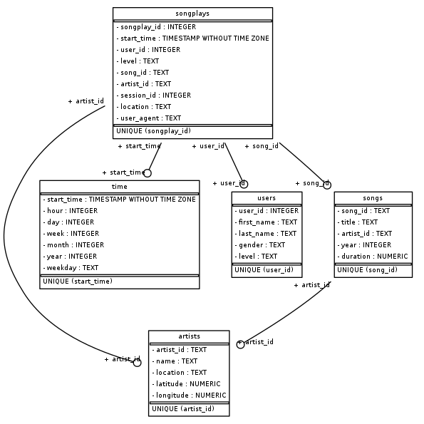

# ETL Pipeline For a Music Streaming App - Python & PostgreSQL
## Context
The analyticts Team of Sparkify, a music streaming Startup wants to analyze the data they have about songs and user activity on their music streaming app. The team is particularly interested in understanding what songs users are listening to. However, there is no straightforward way to do so and querying json files containing songs Metadata and user activity logs seems with a lot of inefficiency and complexity.

## :dart: Objective
The goal is to create a Postgres database schema for a particular analytic focus with tables designed to optimize queries on song play analysis and build an ETL pipeline to automate extracting, transforming and loading the JSON data residing in files and directories into the database. You'll be able to test your database and ETL pipeline by running queries given to you by the analytics team from Sparkify and compare your results with their expected results.

## :checkered_flag: Analytics Goals
>Sparkify expects to write queries against the database to gain insights out of the behavior of its users and trends on songs in order to better serve them in the future and suggest more suitable and precise songs/products recommendations. Some of the insights that the analytics team may be interested in :
>
>> - Knowing how often songs from a specific artist were listened to.
>> - Being aware of how many users are using their service at any given time of the day or the week or even the year.
>> - Sparkify can analyze the songs that users are frequently listening to in order to personalize their recommendations of new tracks for each of its users.

## :heavy_check_mark: Data Modeling
The PostgreSQL database was modeled according to a Star schema, with the songplays table at its center. The schema is normalized, and the songplays table references the songs and artists tables filled with songs Metadata informations, as well as the users and time tables containing insights on users and detailed timestamps of song plays. The data Model is depicted in the diagram below:



The different tables are listed below:
### songplays : Fact Table
`songplay_id, start_time, user_id, level, song_id, artist_id, session_id, location, user_agent`

### users : Dimension Table
`user_id, first_name, last_name, gender, level`

### songs : Dimension Table
`song_id, title, artist_id, year, duration`

### artists : Dimension Table
`artist_id, name, location, lattitude, longitude`

### time : Dimension Table
`start_time, hour, day, week, month, year, weekday`

## ETL Pipeline

The ETL pipeline works in 3 steps:

1. Extract- The file structure is walked, and relevant JSON files are read in a pandas dataframes
2. Transform- The required data is pulled out of the dataframes and formatted as required by the database
3. Load - The formatted data is inserted into their destination tables

To do so, we manage to:  

- Process song files
    - Insert unique songs records
    - Insert unique artists records
- Process log files
    - Filter by "NextSong" action
    - Insert time records
    - Insert unique user records
    - Insert songplays records, getting songid and artistid from a JOIN between songs and artists tables

## Example Query

- The TOP 10 users who are the most engaged with the App and Their Subscription Type

```SQL
SELECT users.user_id, users.first_name, users.level, COUNT(*) as Frequency 
FROM songplays 
JOIN users ON songplays.user_id=users.user_id 
GROUP BY users.user_id, users.first_name, users.level
ORDER BY Frequency DESC LIMIT 10;
```
- Results :
<pre>
user_id	    first_name	    last_name	    level	    frequency  
49	    Chloe	    Cuevas	    paid	689  
80	    Tegan	    Levine	    paid	665  
97	    Kate	    Harrell	    paid	557  
15	    Lily	    Koch	    paid	463  
44	    Aleena	    Kirby	    paid	397  
29	    Jacqueline	    Lynch	    free	346  
24	    Layla	    Griffin	    paid	321  
73	    Jacob	    Klein	    paid	289  
88	    Mohammad	    Rodriguez	    free	270  
36	    Matthew	    Jones	    paid	248  
</pre>
## Project Structure
- `sql_queries.py` - queries for creating tables and entering data
- `create_tables.py` - drops and creates tables, used to reset tables prior to running ETL scripts
- `test.ipynb` - checks if data is correctly entered
- `etl.py` - populates tables based on all user activity and song metadata JSON files
- `db.py` - return a dictionary that represents the db characterists (host, dbname, user, password)
- `database.ini` - configuration file : convenient way to store all db connection parameters and minimize changes to the code when changing environments

## Setup
1. Run pip install -r requirements.txt to install required libraries.
2. Run python create_tables.py to create the database and the tables.
3. Run python etl.py to run the etl pipeline that extracts the data from JSON files and populates the tables created in the previous step.